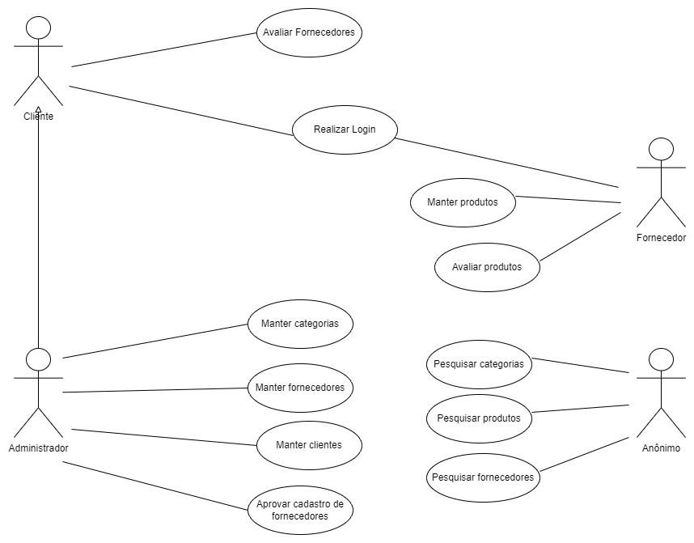

# **Api Sistema REGALE**
## **Introdução**
A todo momento surgem novos estabelecimentos comerciais, muitos dos quais não têm os meios de promoção ou são de difícil localização. O Sistema REGALE possui a proposta de solucionar esse problema, com foco em confeitarias, ele permite ao usuário através de um sistema web localizar as confeitarias mais próximas a sua localidade. Assim como os produtos ofertados por elas.
A API foi desenvolvida utilizando o NodeJs, ExpressJs e Banco de dados MongoDB.
<br/>
<br/>
O Front-End foi desenvolvido utilizando o ReactJs, e está disponível para consulta no link abaixo:
```
git clone https://github.com/danielbarbozadasilva/system-management-frontend.git
```
<br/>
<br/>

## **Escopo do produto**
O Sistema tem como objetivo listar as confeitarias e gerenciá-las, possibilitando a consulta por parte dos clientes. O projeto tem como objetivo divulgar as confeitarias, principalmente aquelas que estão começando no mercado, ou que não são muito conhecidas. Permite oferecer mais opções de produtos e preços.
<br/>
<br/>

## **Descrição geral**
REGALE é um sistema web que visa estabelecer um relacionamento entre o cliente e um nicho de mercado específico. Todas as suas funcionalidades foram pensadas para proporcionar conforto e comodidade aos seus usuários.

A proposta do Sistema é divulgar estabelecimentos, cujo problema se faz presente em confeitarias que estão iniciando no mercado, pois ainda não possuem uma forma eficaz de divulgação.

Além de realizar a divulgação, o Sistema disponibiliza uma interface amigável e de fácil uso para o usuário da plataforma. Os usuários do sistema são o administrador, o proprietário da confeitaria (fornecedor) e o cliente. Onde todos têm acesso ao sistema de acordo com suas credenciais e permissões de acesso. 

O Sistema permite ao Administrador gerenciar categorias, fornecedores e clientes. O proprietário da confeitaria pode gerenciar seus produtos, assim como favoritá-los. O cliente possui a opção de avaliar os fornecedores. Além disso, o Sistema possui uma tela inicial que permite ao público em geral navegar facilmente através de filtros de busca entre categorias, produtos e fornecedores.
<br/>
<br/>

## **Instalação com Docker**
Clone o repositório na pasta de sua preferência.
```
git clone https://github.com/danielbarbozadasilva/system-management-backend.git
```

Abra a pasta do repositório clonado, e crie um arquivo ".env", exemplo:
```
PORT=3011

MONGO_HOST=localhost:27017
MONGO_DB_NAME=PROJETO04

MD5_SECRET=teste_secret_password
JWT_SECRET=dsfsfdsfdsdsdsfdsfs
JWT_VALID_TIME=9000000000
URL=http://localhost:3000
IMAGE_PATH=http://localhost:3011/static/

SENDGRID_SENDER=example@gmail.com
SENDGRID_API_KEY=example
```

Abra a pasta do repositório clonado, e instale as dependências do projeto através do comando:
```
npm install
```

Logo após o término da instalação. Instale o Docker e o docker compose através do link: 
```
https://docs.docker.com/desktop/windows/install/
```
Com o Docker instalado, abra o terminal na pasta do projeto e execute o seguinte comando:
```
docker-compose up
``` 
Obs.: O comando acima populará o banco de dados com as migrations e os seeders.
<br />
<br />


Execute o comando para rodar o projeto:
```
npm run dev
```

Com o projeto rodando, abra a documentação do Postman na pasta do projeto:
```
docs -> PROJETO04.postman_collection.json
```
<br/>

# **Levantamento de requisitos**

## **Requisitos funcionais**
<br/>

RF001 – O sistema deve controlar a autenticação dos usuários.

RF002 – O sistema deve manter cadastro de clientes.

RF003 – O sistema deve manter cadastro de fornecedores.

RF004 – O sistema deve manter categorias.

RF005 – O sistema deve manter produtos.

RF006 – O sistema deve aprovar ou bloquear o acesso do fornecedor.

RF007 – O sistema deve enviar um e-mail ao fornecedor informando a ativação ou bloqueio da conta.

RF008 – O sistema deve favoritar fornecedores.

RF009 – O sistema deve favoritar produtos.

RF010 – O sistema deve listar os clientes por fornecedor.

RF011 – O sistema deve listar os fornecedores ordenados por número de curtidas e por ordem alfabética.

RF012 – O sistema deve listar os produtos por categoria.

RF013 – O sistema deve filtrar os produtos por nome e ordenação.

RF014 – O sistema deve listar os produtos por fornecedor.

RF015 – O sistema deve filtrar os fornecedores por localidade e ordem alfabética.

<br/>
<br/>

## **Requisitos não funcionais**
<br/>

| Identificação | Classificação | Descrição |
| --- | --- | --- |
|RNF001   |Implementação     |O back-end do sistema deve ser desenvolvido em NodeJs e ExpressJs.    |
|RNF002   |Implementação     | O front-end do sistema deve ser desenvolvido em ReactJs.    |
|RNF003   |Implementação     |O banco de dados a ser utilizado é o MongoDB.     |
|RNF004   |Implementação     | O sistema deve funcionar em Sistemas Operacionais Windows, Mac e Linux.    |
|  |  |  |

<br/>
<br/>

## **Regras de negócio**
<br/>

| Identificação | Classificação | Descrição |
| --- | --- | --- |
|RN001   |Controle de acesso     |Os acessos permitidos ao sistema serão: Administrador, Fornecedor (confeitaria) e Cliente. O usuário anonimo terá acesso apenas ao portal do site.    |
|RN002   |Controle de veracidade     | Apenas fornecedores autorizados pelo administrador poderão ter acesso ao sistema.    |
|RN003   |Limite de ação     |Apenas o Administrador poderá incluir, editar e excluir categorias no sistema.     |
|RN004   |Limite de ação     | Apenas o Administrador poderá visualizar informações sobre os clientes.    |
|RN005   |Controle de estoque     | Somente o gerente da confeitaria (fornecedor) terá permissão para incluir, alterar e excluir seus produtos no sistema.    |
|RN006   |Limite de ação     | Somente o gerente da confeitaria (fornecedor) terá permissão de favoritar os seus próprios produtos.  
|RN007   |Limite de ação     | O gerente da confeitaria (fornecedor) terá permissão de favoritar apenas 3 (três) de seus próprios produtos.   
|RN008   |Limite de ação     | Somente o cliente terá permissão de favoritar a confeitaria (fornecedor).  
|RN009   |Limite de ação     | O cliente terá permissão de favoritar apenas 3 (três) fornecedores.  
|  |  |  |

<br/>
<br/>

## **Lista de atores e casos de uso**
<br/>

## Lista de atores que interagem com o sistema:
* Administrador
* Fornecedor (confeitaria)
* Cliente
* Anônimo
<br/>
<br/>

## Lista de Casos de Uso:
<br/>

1 - Manter categorias

2 - Manter fornecedores

3 - Manter clientes

4 - Aprovar cadastro de fornecedores

5 - Manter produtos

6 - Avaliar produtos

7 - Avaliar fornecedores

8 - pesquisar categorias

9 - pesquisar produtos

10 - pesquisar fornecedores
<br/>
<br/>

## **Diagrama de Casos de uso**
<br/>


<br/>
<br/>

> ## Licença
- Licença GPLv3
<br/>
<br/>
<br/>

> ## Metodologias e Padrões
* Conventional commits
* MVC
* GitFlow
* Error handler

<br/>
<br/>
<br/>

> ## Bibliotecas e Ferramentas
* SendGrid
* Docker
* MongoDb
* Formidable
* Md5
* Uuid
* Path
* Joi
* Http-status
* Mongoose
* Nodemon
* Git
* JsonWebToken
* Express
* Eslint
* Prettier
* FileSystem